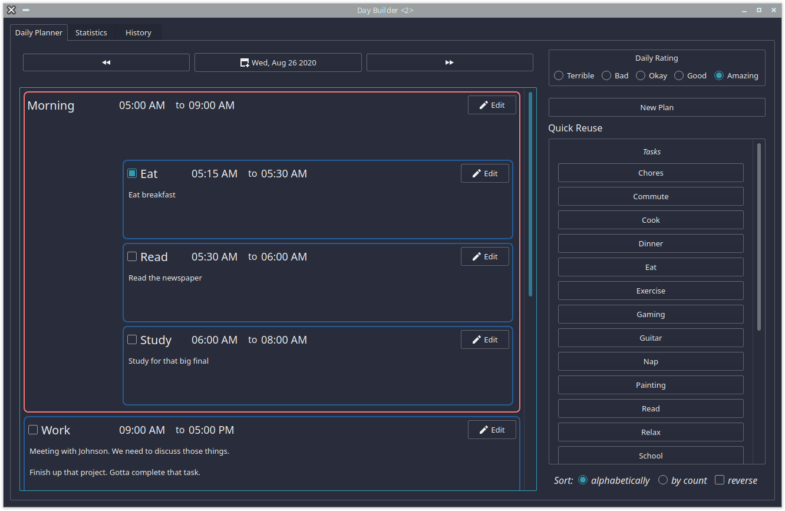
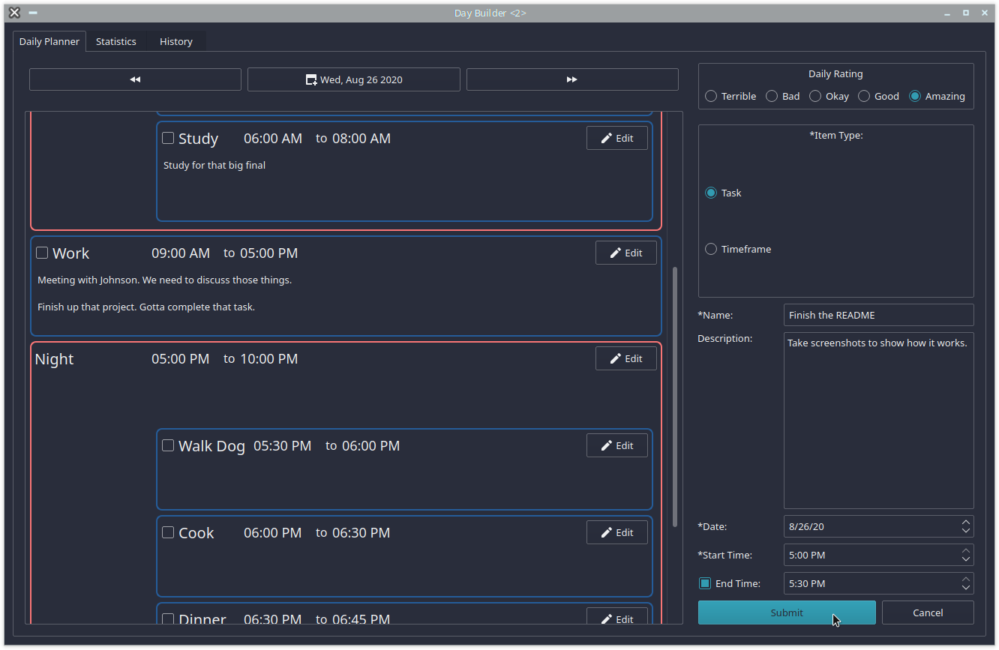
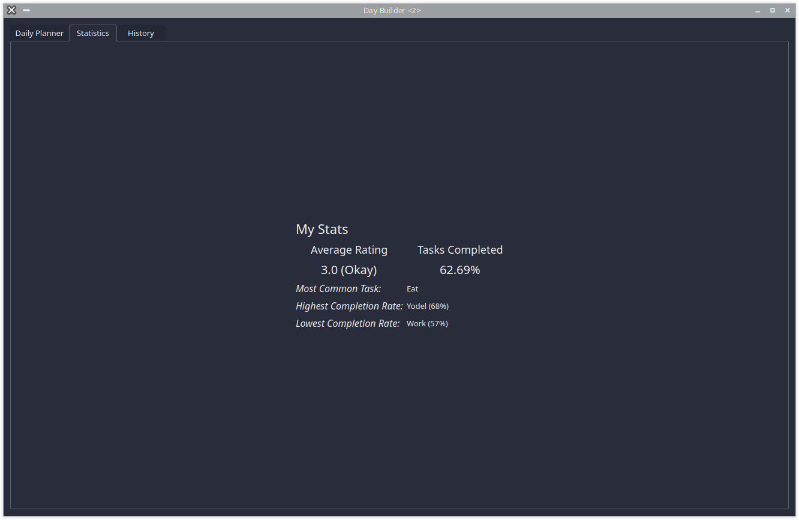
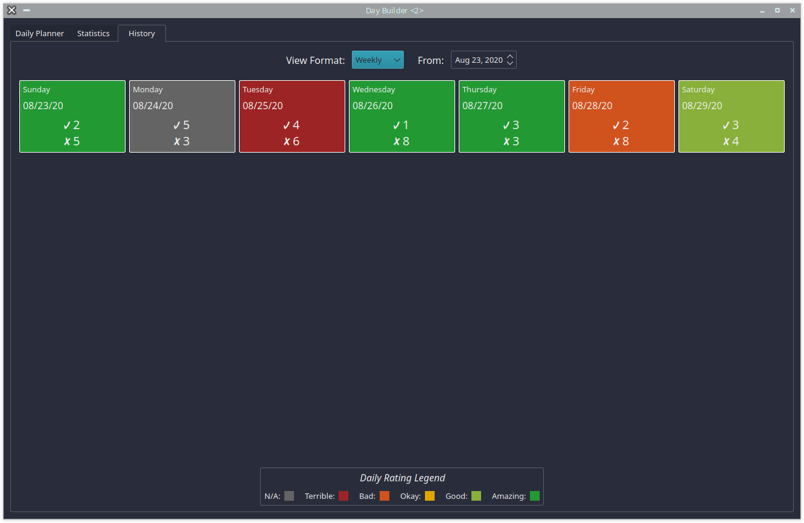
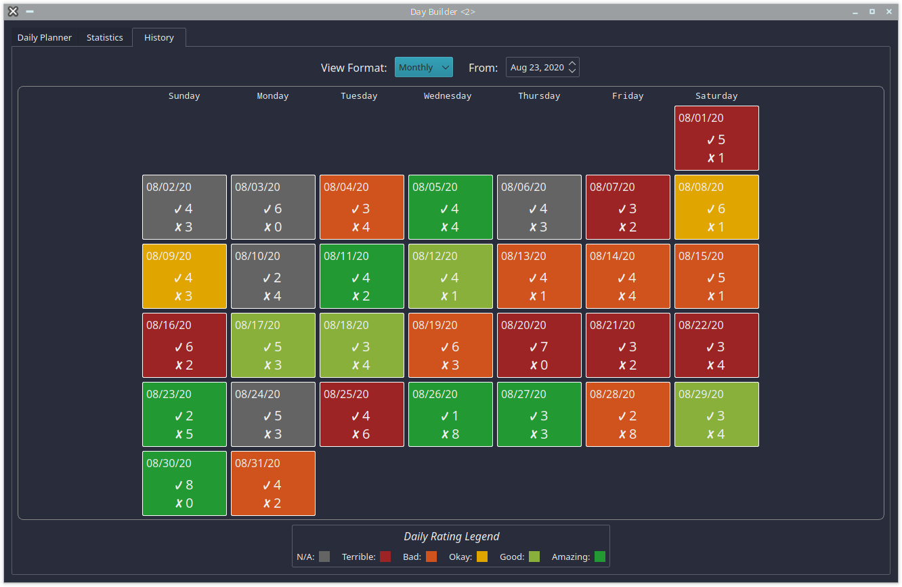

# Day Builder

Day Builder is a daily planner designed to help you visualize your day ahead of time and reflect on past days.

Made in Python using sqlite3, PyQt5, and Pandas

## Features

### Daily Planner
- View your plans and make new plans on the daily planner tab

- Click 'New Plan' or any of the buttons in the 'Quick Reuse' section to open the 'New Task Form'

- schedule plans for specific dates and times.
- split days into timeframes to help visualize your day and prepare for the different parts of it
- rate your days on a scale from 1 to 5
- quickly schedule tasks and timeframes you have planned previously using the template sidebar

### Statistics
- as you build schedules and rate days the program will be able to calculate various statistics from your history
- gives you an opportunity to view your habits and routines empirically

### History
- view a quick summary of your past days in a weekly and monthly format

## TODO

### New Features
- In the Daily Planner section make a split view where you can record the outcomes of your day and compare them to your plans
- Learn more about Pandas and add more statistics
  - 'You are more likely to complete X in the morning / night'
  - 'You tend to rate days with X task higher than average'

### Program Style/Structure
- Learn how to write and use setup.py

## Credit
I use the Silk icons pack when the user does not have any Qt themes.
  > Silk Icons (http://www.famfamfam.com/lab/icons/silk/)
